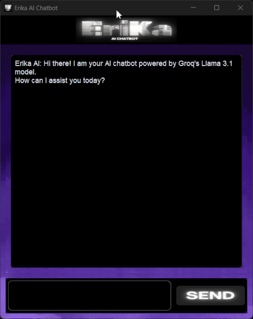

# [](https://github.com/KrishnaSingh-bit/Erika-AI-Chatbot)

Erika AI is a desktop chatbot application built using **Python**. It allows users to interact with an AI model (like OpenAI's GPT models or Groq AI models) in real-time, providing a smooth and visually appealing chat interface. The AI model used is configurable via the `config.py` file.

---

## Appilcation DEMO



---

## Features

- Modern GUI built with **CustomTkinter**.
- Supports custom **background and header images**.
- AI responses typed out character by character for a realistic chat experience.
- Supports **any API-compatible AI model**.
- Easy to configure via a `config.py` file.
- User-friendly interface.

---

## Installation

1. Clone the repository:

```
git clone https://github.com/KrishnaSingh-bit/Erika-AI-Chatbot.git
cd Erika-AI-Chatbot
```

2. Install the required dependencies:

```
pip install -r requirements.txt
```

### Dependencies include:
- customtkinter
- Pillow
- requests

**Add your API credentials in config.py:**
```
# config.py
API_KEY = "YOUR_API_KEY"
API_URL = "YOUR_API_URL"
MODEL = "YOUR_MODEL_NAME"
Model_name = "YOUR_MODEL_DISPLAY_NAME"
Make sure to replace the placeholders with your actual API credentials.
```
---

### Usage
Run the main application:
```
python Erika AI Chatbot.py
```

- The GUI will open with a welcome message from Erika AI.
- Type your message in the input box and press Enter or click the Send button.
- Erika AI will respond in the chat box.

---

## Folder Structure

```
Erika-AI-Chatbot/
│
├── images/                  # Contains background, logo, and button images
|   ├── app.gif
│   ├── background.png
│   ├── logo.ico
|   ├── logo.png
│   ├── logo1.png
│   └── send1.png
│
├── Erika AI Chatbot.py                  # Main application file
├── config.py                # API configuration file
├── requirements.txt         # Python dependencies
└── README.md
```
---

### Contributing
**Fork the repository.**
- Create a new branch: git checkout -b feature-name
- Make your changes and commit: git commit -m "Description of change"
- Push to the branch: git push origin feature-name
- Create a pull request.

---

### License
This project is licensed under the MIT License. See the LICENSE file for details.

---

## Author

Krishna Singh
[GitHub](https://github.com/KrishnaSingh-bit/)

---

## Notes
- Make sure your AI API supports the same request format as defined in AIChat() function.
- For faster AI responses, reduce or remove the typing delay in display_message() function.


---


